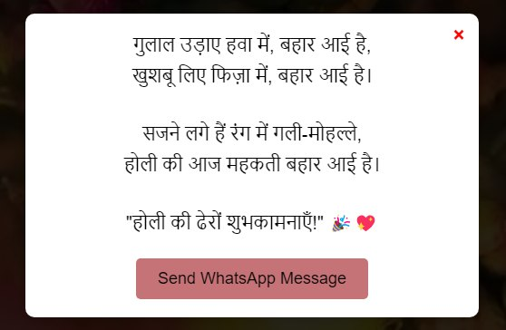

# 🌈 Happy Holi - Festival of Colors 🎨

Welcome to **Happy Holi**, a vibrant and interactive web experience designed to bring the joy and spirit of Holi right to your screen! This project includes a dynamic background video, festive music, and an interactive greeting modal to share the Holi spirit with your loved ones. 🎊🎶

---

## 🎉 Features

- **🎥 Background Video:** A stunning Holi-themed video playing in the background to set the festive mood.
- **🎶 Auto-Playing Music:** Holi special music starts playing when the site loads and enhances the experience.
- **📜 Interactive Greeting Card:** Click on the **"Open Letter"** button to reveal a beautifully animated Holi wish.
- **💬 WhatsApp Sharing:** Instantly share the Holi greetings with friends and family on WhatsApp.
- **🔥 Smooth Animations:** Powered by **GSAP**, making interactions feel smooth and lively.
- **🌟 Responsive Design:** Fully optimized for mobile and desktop devices.

---

## 🛠️ Technologies Used

- **HTML5** - Structure of the webpage
- **CSS3** - Custom styling and animations
- **JavaScript (ES6)** - Interactivity and DOM manipulations
- **GSAP (GreenSock)** - Smooth animations and transitions
- **Google Fonts** - Custom typography for a unique look
- **FontAwesome** - Icons for better UI experience

---

## 🚀 Installation & Setup

1. **Clone the Repository:**
   ```sh
   git clone https://github.com/yourusername/happy-holi.git
   ```
2. **Navigate to the Project Folder:**
   ```sh
   cd happy-holi
   ```
3. **Open `index.html` in a Browser** and Enjoy the Festival of Colors! 🎨

---

## 📸 Screenshots

| Homepage | Opened Greeting |
|----------|---------------|
|  |  |

---

## 🎁 Contributing

Want to make this experience even better? Feel free to **fork** the repository, create a new branch, and submit a **pull request** with your improvements. 🚀

---

## 💖 Acknowledgments

Big thanks to all **open-source** developers and designers who contribute to making the web a colorful place! 🎨

---

## 📢 Connect with Me

📧 Email: [bistdipesh75@gmail.com](mailto:bistdipesh75@gmail.com)  
📷 Instagram: [@lieutenant_colonel7](https://www.instagram.com/lieutenant_colonel7/)

Happy Coding & Happy Holi! 🎊✨

